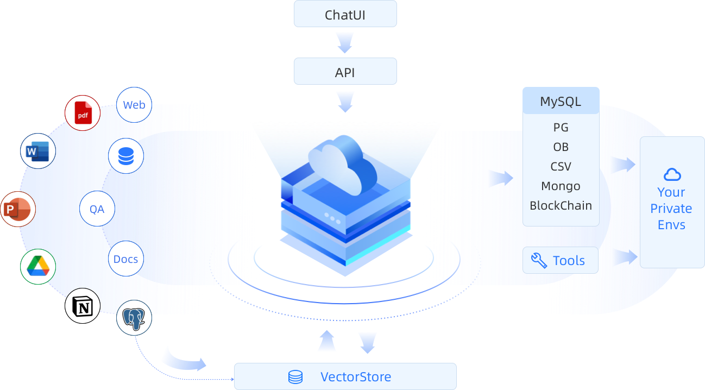

# DB-GPT Website

[DB-GPT](http://dbgpt.io) is an experimental open-source project that uses localized GPT large models to interact with your data and environment. With this solution, you can be assured that there is no risk of data leakage, and your data is 100% private and secure.



## Installation

```commandline

# clone current project firstly!
# install docusaurus dependencies, generate .docusaurus and node_modules folder.
npm install

# build project.
sudo npm run build 

# launch project.
npm run serve
```

The default service starts on port `3000`, visit `localhost:3000`
